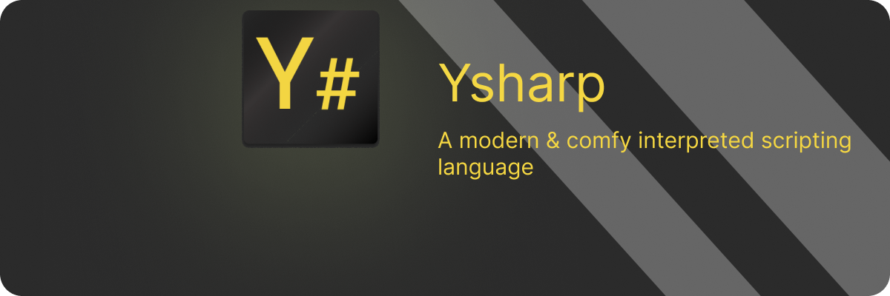

Ysharp is a small interpreted scripting language with a friendly,
C-like syntax, dynamic typing, and a standard library of native utilities. 
It is implemented as a classic three-stage
interpreter (lexer -> parser -> evaluator) in Java.

````ysharp
println "Hello Ysharp!";
````

> ⚠️ **Warning**  
> Ysharp is still a WIP (work in progress) language. Expect breaking changes!

### Quick Start

Prerequisites: Java Development Kit (JDK) 21 or later must be installed and available on your system PATH.

For setup instructions and full API documentation, please refer to the official documentation:

https://yagizerdem.github.io/Ysharp/


### Example Rock-Paper-Scissors Game in Ysharp

````ysharp
println "Rock Paper Scissors in Ysharp!";

var moves = ["rock", "paper", "scissors"];

var beats = {
    "rock": "scissors",
    "paper": "rock",
    "scissors": "paper"
};

while(true) do
    print("\nMake your move: ");
    var user = __input();

    if user == "q" then do break; end

    if !moves.contains(user) then do
        print("Invalid move! Valid moves are: ");
        println moves.toString();
        continue;
    end

    var computer = moves.get(Random.nextInt(0, moves.size()));

    println "\nYour move: " + user ;
    println "Computer's move: " + computer;

    if beats.get(computer) == user then do println "\nComputer wins!"; end
    if beats.get(user) == computer then do println "\nYou win!"; end
    if user == computer then do println "\nIt's a draw!"; end
end
````

## Ysharp at a Glance

---

See the [official documentation](https://yagizerdem.github.io/Ysharp/) for a complete reference and detailed explanations of Ysharp features.

- **Values & Types** <br/> 
`type()` on any value; conversions via helpers like `double()`, `str()`.


- **Strings** <br/>
Indexing and slicing; `length()`, `repeat(n)` and related string utilities.


- **Arrays** <br/>
Dynamic arrays with `size()`, `add()`, `pop()`, `insert(i, v)`, `remove(i)`, `get()`, `contains(v)`.


- **HashMaps** <br/>
Key-value maps; `size()`, `containsKey(k)`, `put(k, v)`, `remove(k)`, `get(k)`, `keys()`, `values()`.


- **Control Flow** <br/>
`if / else`, `while`, `for .. in`, ternary `cond ? a : b`, ranges.


- **Errors** <br/>
`try / catch` and `throw`; runtime error handling.


- **Objects & Functions** <br/>
First-class functions; prototype-based objects with `constructor()`, static methods, and bound methods using `this`.

--- 

### Repository Layout

- examples - example Ysharp scripts
- src/lexer - tokenizer
- src/parser - recursive descent parser producing AST
- src/evaluator - tree-walk interpreter and stdlib natives
- webdoc -  full language reference

---

### Author

Yagiz Erdem  
Computer Engineering Student  
yagizerdem819@gmail.com

--- 

### License

Released under MIT License
